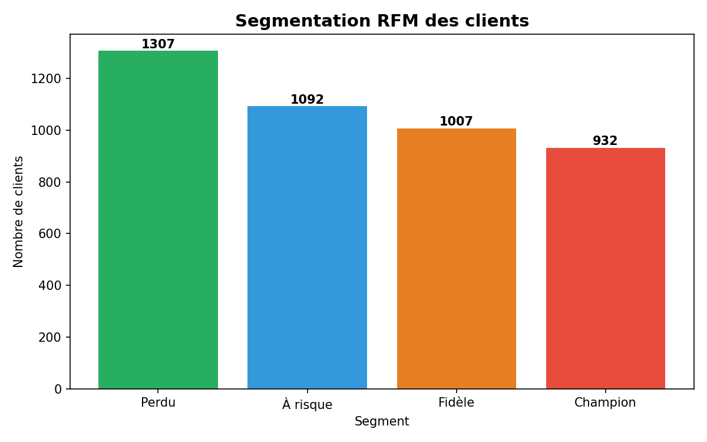
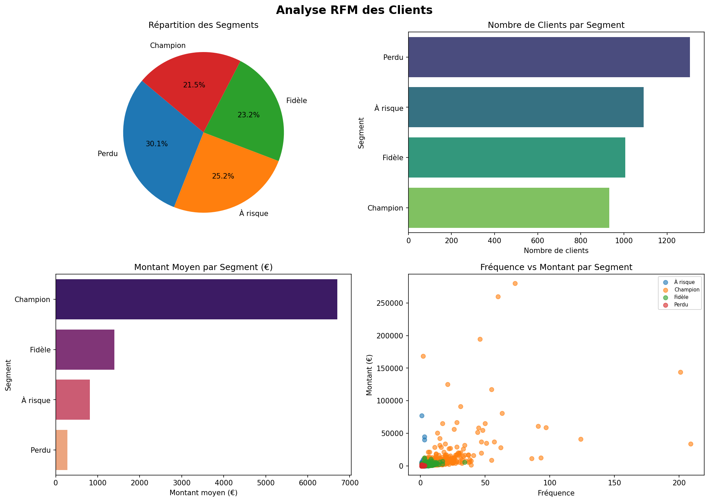
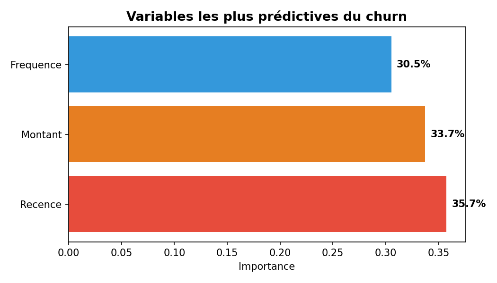
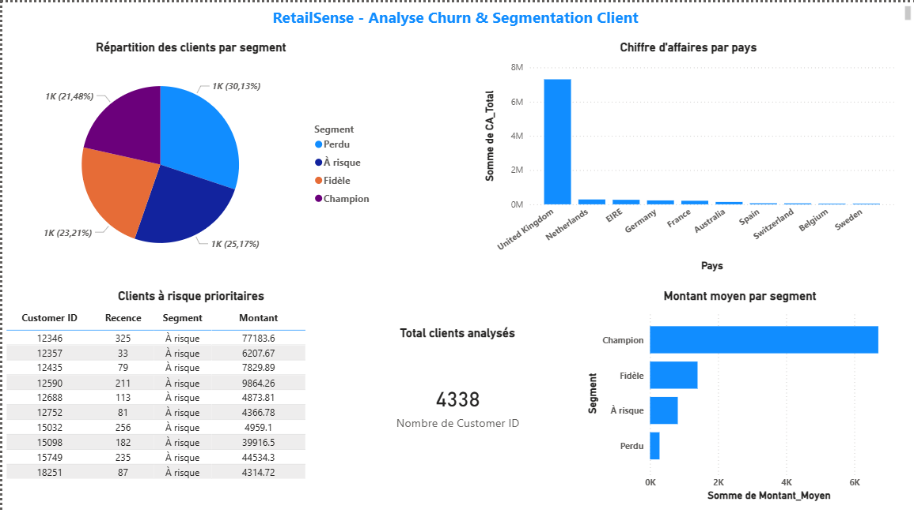

# 🔵 RetailSense — Analyse Churn & Segmentation Client E-commerce

> Projet personnel réalisé dans le cadre d'une formation MBA Big Data & IA  
> pour développer des compétences concrètes en analyse de données et Machine Learning.

---

## 📌 Problématique

Dans le secteur e-commerce, **acquérir un nouveau client coûte 5 à 7 fois plus cher**
que d'en fidéliser un existant. Pourtant, la majorité des enseignes ne disposent pas
d'un système pour identifier les clients sur le point de partir.

RetailSense répond à cette problématique en analysant le comportement d'achat
de **4 338 clients réels** sur 1 an, en les segmentant par valeur business,
et en prédisant leur risque de churn avec un modèle Machine Learning.

**🎯 Résultat : 96% de précision sur la prédiction du churn.**

---

## 📊 Dataset

| Caractéristique | Détail |
|---|---|
| Source | Online Retail II — UCI Machine Learning Repository (Kaggle) |
| Période | Décembre 2010 — Décembre 2011 |
| Volume brut | 541 910 transactions |
| Volume nettoyé | 397 885 transactions exploitables |
| Clients uniques | 4 338 |
| Marché | E-commerce United Kingdom |

---

## 🔍 Méthodologie

### Étape 1 — Nettoyage des données
- Suppression des 135 080 lignes sans `Customer ID`
- Suppression des retours (`Quantity < 0`) et annulations (`Invoice` commençant par "C")
- Suppression des prix nuls ou négatifs
- Création de la colonne `TotalPrice = Quantity × Price`

### Étape 2 — Segmentation RFM
Calcul de 3 métriques clés par client :

| Métrique | Définition |
|---|---|
| **R**écence | Nombre de jours depuis le dernier achat |
| **F**réquence | Nombre de commandes distinctes |
| **M**ontant | Chiffre d'affaires total généré |

Résultats de la segmentation :

| Segment | Clients | % | Montant Moyen | Récence Moyenne |
|---|---|---|---|---|
| 🏆 Champion | 932 | 21% | 6 705£ | 14 jours |
| 💙 Fidèle | 1 007 | 23% | 1 396£ | 43 jours |
| ⚠️ À risque | 1 092 | 25% | 816£ | 85 jours |
| 🔴 Perdu | 1 307 | 30% | 280£ | 191 jours |

### Étape 3 — Modèle de prédiction du churn

- **Algorithme** : Random Forest (100 arbres)
- **Split** : 80% entraînement / 20% test
- **Accuracy globale** : 96%

| Classe | Précision | Recall | F1-Score |
|---|---|---|---|
| Non churné | 97% | 98% | 97% |
| Churné | 95% | 93% | 94% |

**Variables les plus prédictives :**

| Variable | Importance |
|---|---|
| Récence | 35.7% |
| Montant | 33.7% |
| Fréquence | 30.5% |

### Étape 4 — Analyse SQL
Requêtes analytiques sur SQLite pour identifier :
- Top 10 pays par chiffre d'affaires
- Comportement moyen par segment
- Clients à risque haute valeur (montant > 1 000£)

### Étape 5 — Dashboard Power BI
Restitution décideur avec 5 visuels interactifs.

---

## 🖼️ Aperçu

### Segmentation RFM


### Analyse RFM complète


### Importance des variables prédictives


### Dashboard Power BI


---

## 🛠️ Stack technique

| Outil | Rôle |
|---|---|
| Python · pandas | Chargement, nettoyage, exploration |
| Python · scikit-learn | Modèle Random Forest |
| SQLite | Requêtes analytiques SQL |
| Matplotlib · Seaborn | Visualisations |
| Power BI | Dashboard décideur interactif |
| Git | Versioning |

---
## 📂 Structure du repo

```
retailsense/
│
├── data/
│   ├── sample_data.csv                  ← Clients RFM segmentés (4 338 clients)
│   ├── segments.csv                     ← Analyse par segment
│   └── top_pays.csv                     ← CA par pays (Top 10)
│
├── notebooks/
│   └── exploration.ipynb                ← Analyse complète Python + SQL
│
├── dashboard/
│   └── RetailSense_Dashboard.pbix       ← Dashboard Power BI (à ouvrir avec Power BI Desktop)
│
├── docs/
│   ├── segmentation_rfm.png             ← Graphique segments
│   ├── analyse_rfm.png                  ← Dashboard RFM 4 visuels
│   ├── importance_variables.png         ← Variables prédictives churn
│   ├── dashboard_powerbi.png            ← Capture dashboard Power BI
│   └── méthodologie.md                  ← Approche projet, phases, décisions techniques
│
└── README.md                            ← Documentation pro + architecture + screenshots
```

---
## 💡 Insights clés

- **55% des clients sont perdus ou à risque** — opportunité de rétention massive
- **Les Champions dépensent 24x plus que les Perdus** (6 705£ vs 280£)
- **Le client 12346 est le cas le plus critique** — 77 183£ de CA historique mais inactif depuis 325 jours
- **Le UK représente 94% du CA total** — concentration géographique risquée
- **La Récence est le signal le plus fort du churn** (36%) — un client qui n'achète plus est le premier signe d'alerte


---

## 👤 Auteur

**Déhollin HOLLAT** — Chef de Projet Data IA  
